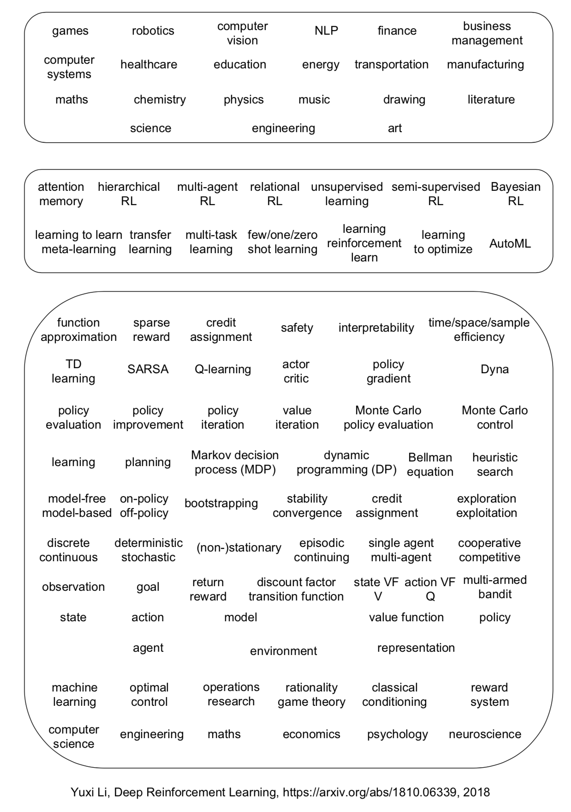

### Ongoing courses and workshops

- [CSE 691 Reinforcement Learning and Optimal Control Winter 2019](http://web.mit.edu/dimitrib/www/RLbook.html) at ASU by Dimitri P. Bertsekas
  - Find slides and videos at `SLIDES AND VIDEO LECTURES`

- [CS234: Reinforcement Learning Winter 2019](http://web.stanford.edu/class/cs234/index.html) by Emma Brunskill

### Surveys

> Deep reinforcement learning is the combination of reinforcement learning (RL) and deep learning.
> This field of research has been able to solve a wide range of complex decision making tasks that were previously out of reach for a machine.
> Thus, deep RL opens up many new applications in domains such as healthcare, robotics, smart grids, finance, and many more.

------ Vincent François-Lavet, Peter Henderson, Riashat Islam, Marc G. Bellemare and Joelle Pineau (2018), “[An Introduction to Deep Reinforcement Learning](https://arxiv.org/abs/1811.12560)”, in Foundations and Trends in Machine Learning: Vol. 11, No. 3-4. DOI: 10.1561/2200000071.

Another recent survey [Deep Reinforcement Learning](https://arxiv.org/abs/1810.06339) by Yuxi Li Under review for Morgan & Claypool: Synthesis Lectures in Artificial Intelligence and Machine Learning
draw a comprehensive blueprint on modern (Deep) Reinforcement Learning.

### Courses and books

There are a lot of resources and courses we can refer.
- CS 294-112 (2018Fall) [Deep Reinforcement Learning](http://rail.eecs.berkeley.edu/deeprlcourse/) at UC Berkeley
 
- [Spinning Up in Deep RL](https://spinningup.openai.com/en/latest/) by OpenAI

- [Reinforcement Learning: An Introduction](http://incompleteideas.net/book/the-book.html) by the Awesome Richard S. Sutton, Second Edition, MIT Press, Cambridge, MA, 2018

- [Reinforcement Learning and Optimal Control](http://web.mit.edu/dimitrib/www/RLbook.html) by the Awesome Dimitri P. Bertsekas, Athena Scientific, 2019

- [Advanced Deep Learning and Reinforcement Learning](https://github.com/enggen/DeepMind-Advanced-Deep-Learning-and-Reinforcement-Learning) at UCL(2018 Spring) taught by DeepMind’s Research Scientists
 
- [Deep RL Bootcamp](https://sites.google.com/view/deep-rl-bootcamp/lectures) (2017 Summer) at Berkeley
 
- MS&E338 [Reinforcement Learning](https://web.stanford.edu/class/msande338/) at Stanford by Ben Van Roy

### Related workshop

- [Deep Learning and Reinforcement Learning Summer School](http://videolectures.net/DLRLsummerschool2018_toronto/), Toronto 2018 hosted by the Canadian Institute For Advanced Research (CIFAR) and the Vector Institute, with participation and support from the Alberta Machine Intelligence Institute and the Institut québécois d’intelligence artificielle (MILA).

- [Exploration in RL](https://sites.google.com/view/erl-2018/home) at ICML 2018
  - Wonderful video records at [youtube](https://www.youtube.com/playlist?list=PLbSAfmOMweH3YkhlH0d5KaRvFTyhcr30b) including the keynote speech by Ian Osband and panel dicussion modulated by Ben Van Roy.

- [Workshop on Meta-Learning](http://metalearning.ml/2018/) (MetaLearn 2018) at NeurIPS 2018

- [Infer to Control](https://sites.google.com/view/infer2control-nips2018): Workshop on Probabilistic Reinforcement Learning and Structured Control at NeurIPS 2018

- [Deep Reinforcement Learning Workshop](https://sites.google.com/view/deep-rl-workshop-nips-2018/home) at NeurIPS 2018

- [Modeling the Physical World: Perception, Learning, and Control](http://phys2018.csail.mit.edu/program.html) at NeurIPS 2018

- [Workshop on Causal Learning](https://sites.google.com/view/nips2018causallearning/home) at NeurIPS 2018

- [Continual learning Workshop](https://sites.google.com/view/continual2018/home) at NeurIPS 2018

- [Automatic Machine Learning](https://www.automl.org/events/) (AutoML) Tutorial at NeurIPS 2018 by Frank Hutter and Joaquin Vanschoren at NeurIPS 2018

### Resources collection in github

- [60 days RL Challenge](https://github.com/andri27-ts/60_Days_RL_Challenge)

- [Awesome RL](https://github.com/aikorea/awesome-rl)

and more…

### Future Events

- [Deep Learning and Reinforcement Learning Summer School](https://dlrlsummerschool.ca/), July 24 to August 2, 2019, University of Alberta, Edmonton, CA.

### Concepts in (Deep) RL and AI

## Applications

### Healthcare

- The Artificial Intelligence Clinician learns optimal treatment strategies for sepsis in intensive care [Nature](https://www.nature.com/articles/s41591-018-0213-5) [PDF](/static/files/AI-Clinician-optimal-treatment.pdf)

### Games

- TStarBots: Defeating the Cheating Level Builtin AI in StarCraft II in the Full Game [whitepaper](https://arxiv.org/pdf/1809.07193.pdf) [github](https://github.com/Tencent/TStarBots)

- [AlphaStar: Mastering the Real-Time Strategy Game StarCraft II](https://deepmind.com/blog/alphastar-mastering-real-time-strategy-game-starcraft-ii/)

### Robotics

- Learning agile and dynamic motor skills for legged robots [Science Robotics](http://robotics.sciencemag.org/content/4/26/eaau5872)

## Infrastructure and Computing framework

- Ray: a flexible, high-performance distributed execution framework [github](https://github.com/ray-project/ray) [documents](https://ray.readthedocs.io/en/latest/)